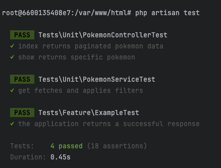

# Projeto Laravel 11 com Docker 🐳

Este projeto utiliza Laravel 11 e está configurado para ser executado em um ambiente Docker. Siga as instruções abaixo para configurar e executar o projeto corretamente.

## Pré-requisitos ⚙️

Certifique-se de ter os seguintes requisitos instalados em sua máquina:

- [Docker](https://www.docker.com/) 🐋
- [Docker Compose](https://docs.docker.com/compose/) 🔧

## Instruções de Configuração 🚀

1. **Copiar o arquivo `.env.example`** 📄

   No diretório raiz do projeto, copie o arquivo `.env.example` para `.env` com o seguinte comando:

   ```bash
   cp .env.example .env
   ```

2. **Subir os containers com Docker Compose** 🏗️

   Inicie os containers necessários para o projeto com o comando:

   ```bash
   docker-compose up -d
   ```

3. **Instalar as dependências do Composer** 📦

   Entre no container da aplicação Laravel com o seguinte comando:

   ```bash
   docker exec -it laravel-app bash
   ```

   Instale os pacotes:

   ```bash
   composer install
   ```

4. **Executar as migrações do banco de dados** 🗄️

   Ainda dentro do container, execute o comando abaixo para aplicar as migrações:

   ```bash
   php artisan migrate
   ```

5. **Acessar a aplicação** 🌐

   A aplicação estará disponível no navegador pelo endereço:

   ```
   http://localhost
   ```

## Executar os Testes 🧪

Para executar os testes automatizados do projeto, basta entrar no container da aplicação e rodar o seguinte comando:

1. Entre no container da aplicação Laravel:

   ```bash
   docker exec -it laravel-app bash
   ```

2. Execute os testes com o comando:

   ```bash
   php artisan test
   ```

   Os resultados dos testes serão exibidos no terminal.



## Documentação da API 📖

Para mais detalhes sobre os endpoints disponíveis na API, [acesse a documentação](docs/openapi.yaml)


## Estrutura do Projeto 📁

- **Aplicação Laravel**: `laravel-app`
- **Banco de Dados**: `laravel-postgres` (PostgreSQL configurado no `docker-compose.yml`)

---
